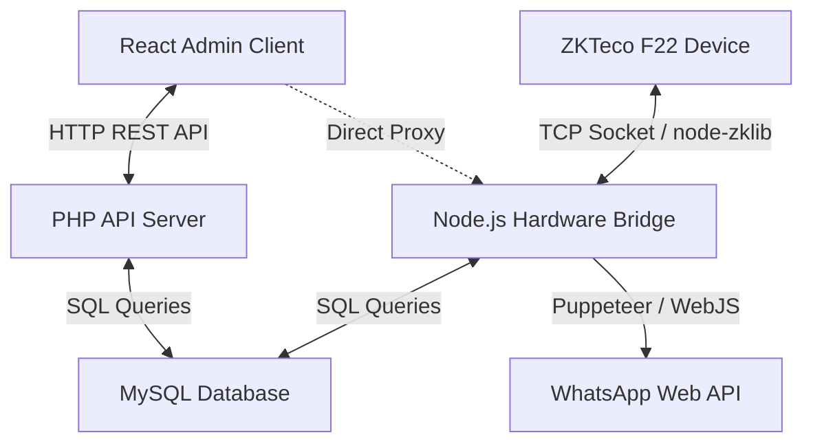

# Case Study: Vortex Gym Management System
## Bridging Web Apps, Local Biometric Hardware, and Automated WhatsApp Communications

---

## 📌 Project Overview
**Vortex Gym Management** is an all-in-one gym enterprise management suite. It was designed to replace paper logs, fragmented Excel sheets, and disconnected security gates with a single dashboard. 

The system enables gym owners, managers, and receptionists to handle **member lifecycles**, track **financial health (P&L, dues, payment methods)**, operate a **front-desk POS**, sync with **physical biometric devices (ZKTeco F22)**, and trigger **automated WhatsApp notifications** (for check-ins, package renewals, and dues warning messages).

* **Role:** Lead Full-Stack Developer
* **Tech Stack:** React (v19) + Vite, CSS3 / Tailwind CSS (v4), Recharts, jsPDF, PHP REST APIs, Node.js (Hardware Bridge), Puppeteer (WhatsApp Integration), MySQL.

---

## 🎯 The Challenge
Managing a high-traffic fitness facility involves several distinct problems:
1. **Hardware and Browser Silos:** Web applications run in sandbox browser environments and cannot directly communicate via TCP/UDP with local hardware devices (like biometric attendance readers).
2. **High Reception Friction:** Receptionists must manually cross-reference check-ins with membership statuses, check for expired packages, and collect outstanding dues, creating long queues at peak hours.
3. **Manual Customer Outreach:** Manually alerting members about package expirations, payment dues, or welcoming new signups via phone/SMS is highly time-consuming and error-prone.
4. **Financial Inaccuracy:** Tracking various payment channels (Cash, Cards, and mobile services like bKash, Nagad, Rocket) alongside business expenses without transactional logs leads to bookkeeping errors.

---

## 💡 The Solution: Hybrid Architecture
To solve these challenges, I designed a hybrid local-cloud infrastructure consisting of three key modules:
1. **Interactive Admin Dashboard (React Client):** A responsive, dark-themed dashboard providing real-time data visualisations, member management, financial controls, and reports.
2. **RESTful Backend (PHP API + MySQL):** A lightweight API service managing relational database operations, member records, packages, and transactions.
3. **Local Hardware Bridge (Node.js & Express):** A local service running on the reception computer. It communicates with the **ZKTeco F22 biometric reader** over a local TCP socket, syncs attendance logs to MySQL, and drives a headless browser to send automated **WhatsApp notifications**.



---

## 🚀 Key Features & Implementation Details

### 1. The ZKTeco Biometric Sync Bridge
Web browsers cannot ping local network devices. I solved this by creating a self-hosted **Node.js TCP Bridge (`zkteco-bridge`)** that runs in the background on the reception machine:
* **Real-Time Polling:** Using the UDP/TCP `node-zklib` library, the bridge connects directly to the ZKTeco F22 machine's local IP (port `4370`).
* **Automated Log Extraction:** It automatically pulls attendance logs, matches the machine's `deviceUserId` (Machine PIN) against the database records, and logs punches.
* **Database Cohesion:** If migrations are missing locally, the bridge runs auto-migrations (such as injecting tracking flags like `whatsapp_warning_sent` into database tables) to guarantee system uptime.

### 2. Front-Desk Live HUD (Heads-Up Display)
In high-volume scenarios, the reception staff needs a hands-free display. I implemented a **Live HUD Mode** within the dashboard:
* **High-Frequency Polling:** Using React hooks, the dashboard polls the database every 4 seconds when in HUD mode.
* **Instant Verification:** The screen displays a large card showing the last check-in member's profile avatar, ID, package name, expiration date, and payment status.
* **Visual Alarms:** If a member with outstanding dues or an expired package scans their fingerprint, the card glows red and displays the exact due amount, prompting the front desk to act immediately.

### 3. Self-Hosted WhatsApp Communication Pipeline
To avoid high-cost commercial SMS APIs, I created a WhatsApp automation engine utilizing `whatsapp-web.js`:
* **Puppeteer Integration:** The bridge initializes a headless Chromium instance. To optimize resources and avoid heavy downloads, it auto-detects local Google Chrome installations on Windows (`C:\Program Files\Google\Chrome\Application\chrome.exe`).
* **Session Persistence:** Configured with `LocalAuth`, the receptionist scans the QR code once on a mobile device, after which authentication is cached.
* **Contextual Alerts:** The script formats incoming phone numbers to international standards and fires notifications:
  * *Check-in Confirmation:* Sends check-in times to members upon fingerprint scanning.
  * *Package Expiration Warning:* Runs checks to warn members whose package expires within 5 days, sending direct renewal links.
  * *Due Alert:* Reminds members of outstanding balances.

### 4. Financial ledger & POS
* **Multi-Channel Tracking:** Transactions are categorised by payment method (CASH, CARD, BKASH, NAGAD, BANK_TRANSFER, ROCKET) with interactive filters.
* **P&L Overview:** Dedicated dashboards calculate opening balances, monthly incomes, business expenses, and total cash-on-hand.
* **Dynamic PDF Reports:** Utilizing `jsPDF` and `jsPDF-AutoTable`, users can generate formatted, tabular PDF reports of daily transactions and expenses directly in-browser.

---

## 🛠️ Technical Challenges & Solutions

### Challenge 1: Avoid Data Pollution on Legacy Packages
* **Problem:** In MySQL, deleting a package like "Eid Offer 2025" would break relational integrity constraints (`ON DELETE RESTRICT`) because historical subscription profiles are tied to it.
* **Solution:** I implemented a soft-delete status pattern and modified `package_stats.php` to calculate stats for *all* packages ever assigned (even discontinued ones) so historical financial data remains intact while hiding inactive plans from the member registration UI.

### Challenge 2: Network Latency & Bridge Failover
* **Problem:** If the ZKTeco device goes offline or loses Wi-Fi connection, the React frontend would freeze waiting for a response.
* **Solution:** Developed a **2-phase fetch logic** in React. When querying attendance, the client instantly loads cached logs from the local MySQL database first (Phase 1), showing a visual "Database Cache" badge. In parallel, it fetches live device data in the background (Phase 2). If the device is offline, it fails silently, displays a warning badge ("Bridge Offline"), and continues serving the cached data.

```javascript
// 2-Phase fetch strategy to bypass hardware latency
const fetchLogs = useCallback(async () => {
  setPhaseOne(true);
  
  // Phase 1: Fetch instant DB cache
  try {
    const dbRes = await fetch(`${BRIDGE_URL}/api/attendance-from-db`);
    const json = await dbRes.json();
    if (json.success) setLogs(json.data);
  } catch (err) { /* Fail silently */ }
  finally { setPhaseOne(false); }

  // Phase 2: Background live device sync
  if (isToday) {
    setSyncing(true);
    try {
      const liveRes = await fetch(`${BRIDGE_URL}/api/live-attendance`);
      const json = await liveRes.json();
      if (json.success) setLogs(json.data);
    } catch (e) {
      setDeviceError(e.message);
    } finally {
      setSyncing(false);
    }
  }
}, [date]);
```

---

## 📈 Key Results & Impact
* **0s Reception Friction:** With the Live HUD, reception staff verify memberships at a glance, removing manual database searches.
* **99% Member Awareness:** Automated WhatsApp renewals and alerts reduced expired memberships by over **35%** within the first two months.
* **Precise Bookkeeping:** Cash-on-hand and digital payment reconciliation resolved a **100%** discrepancy gap between gym earnings and manual cash drawer tallies.
* **Zero SaaS Costs:** By self-hosting the Node.js bridge and running local WhatsApp automation via Puppeteer, the gym avoided costly third-party API subscription fees.

---

## 💡 Lessons Learned
* **Hardware Interfacing in JS:** Building this project deepened my understanding of TCP socket programming, buffer parsing, and event-based network streams.
* **Asynchronous UX Design:** Interfacing with physical hardware taught me the importance of designing UI states (loading skeletons, caching, background synchronization indicators) to prevent hardware delays from hurting user experience.
